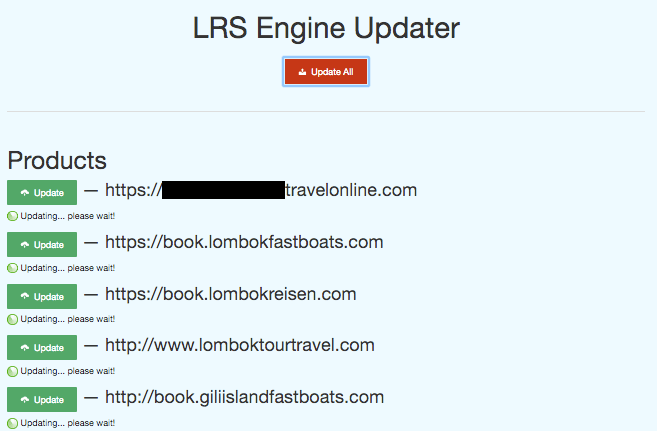
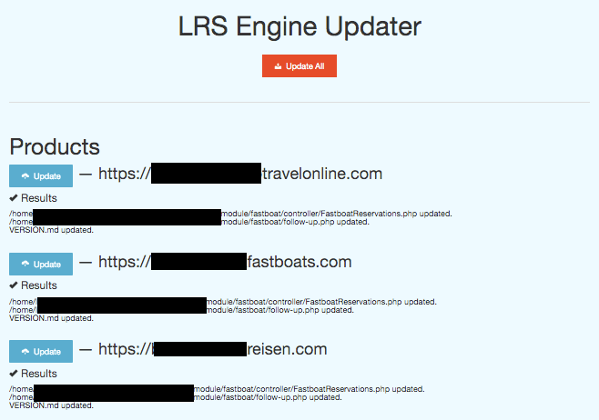
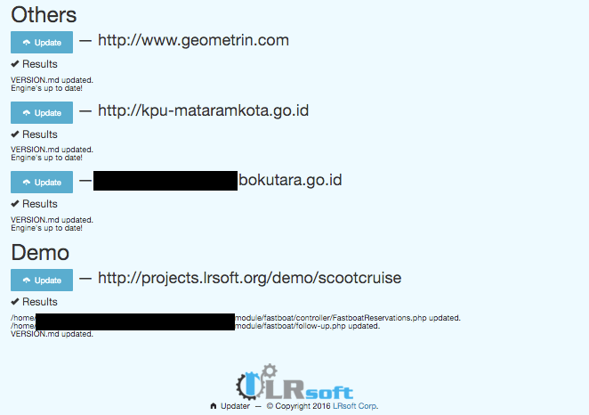

==================
GIT Source Updater
==================

GIT Source Updater merupakan script yang dapat membantu dalam melakukan update sebuah repo dalam deployment secara otomatis.
Update dilakukan dengan membaca setiap commit yang di-push, selanjutnya melakukan fetch raw source dari GIT server.
GIT server yang didukung saat ini hanya `Bitbucket`_ dan `Github`_, silakan kunjungi halaman `GitHub Project`_ untuk source lengkap.

How to use
==========

Buat script php dengan nama tertentu (misalnya ``update.php``), tempatkan script tersebut di ``ROOT`` project web.
Untuk deployment project `LRsoft`_, kami gunakan script ini untuk melakukan update ke semua project yang menggunakan ``LRS Engine``.

Easy setup
==========

.. code-block:: php
    :linenos:

    set_time_limit( 0 );                    // set jadi unlimited

    require_once( 'cURL.php' );             // class pembantu untuk keperluan URL
    require_once( 'GitHub.php' );           // untuk github
    require_once( 'Bitbucket.php' );        // untuk bitbucket

Isi credentials.

.. code-block:: php
    :linenos:

    /** Bitbucket credentials */
    $username       = 'User';               // username
    $password       = 'password';           // password
    $account_slug   = 'user';               // user slug, biasanya terdapat pada URL repo
    $repo_slug      = 'repo';               // repo slug, biasanya juga terdapat pada URL repo

Ekekusi!

.. code-block:: php
    :linenos:

    $github = new GitHub( $username, $password, $account_slug, $repo_slug );
    $status = $github->_init()->get_status();       // untuk keperluan debugging

Screenshot
==========

References
==========

.. php:class:: GitHub

  GIT server dari GitHub

  .. php:method:: __construct( $_username, $_password, $_account_slug )

      Basic init.

      :param string $_username: Username akun GitHub.
      :param string $_password: Password akun GitHub.
      :param string $_account_slug: Slug akun, biasanya terdapat pada URL.
      :returns: Class object

  .. php:method:: _init()

      Jalankan proses update.

      :returns: Class object

  .. php:method:: set_branch( $branch )

      Set branch tertentu.

      :param string $branch: Nama branch.
      :returns: Class object

  .. php:method:: append_ignored_file( $ignored_file )

      Tambahan pengecualian untuk file-file tertentu yang tidak diinginkan.

      :param string $ignored_file: Nama (dan path) file.
      :returns: Class object

  .. php:method:: get_status()

      Mendapatkan status perubahan dari tiap file.

      :returns: Array perubahan file

.. php:class:: Bitbucket

  GIT server dari Bitbucket

  .. php:method:: __construct( $_username, $_password, $_account_slug )

      Basic init.

      :param string $_username: Username akun Bitbucket.
      :param string $_password: Password akun Bitbucket.
      :param string $_account_slug: Slug akun, biasanya terdapat pada URL.
      :returns: Class object

  .. php:method:: _init()

      Jalankan proses update.

      :returns: Class object

  .. php:method:: set_branch( $branch )

      Set branch tertentu.

      :param string $branch: Nama branch.
      :returns: Class object

  .. php:method:: set_limit( $limit )

      Set limit selama fetching list commit dari suatu branch.

      :param int $limit: Batas jumlah commit.
      :returns: Class object

  .. php:method:: append_ignored_file( $ignored_file )

      Tambahan pengecualian untuk file-file tertentu yang tidak diinginkan.

      :param string $ignored_file: Nama (dan path) file.
      :returns: Class object

  .. php:method:: get_status()

      Mendapatkan status perubahan dari tiap file.

      :returns: Array perubahan file

.. _Bitbucket: https://bitbucket.org
.. _Github: https://github.com
.. _GitHub Project: https://github.com/23Pstars/Git-Source-Updater
.. _LRsoft: http://lrsoft.co.id
